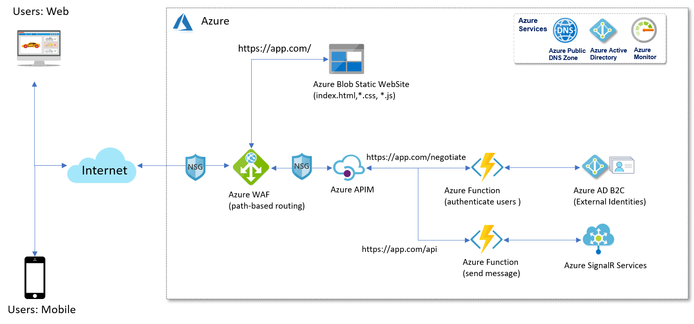
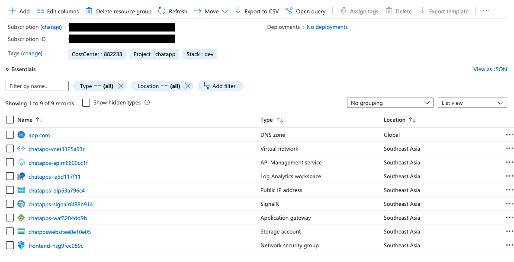

# Introduction

What is Pulumi
> Pulumi is a multi-language and multi-cloud development platform. It lets you create all aspects of cloud programs using real languages and real code, from infrastructure on up to the application itself. Just write programs and run them, and Pulumi figures out the rest.

## Pre-requisite

1. Install Pulumi https://www.pulumi.com/docs/get-started/install/

2. Install Azure CLI https://docs.microsoft.com/en-us/cli/azure/install-azure-cli?view=azure-cli-latest


## Quick Start

Using Azure Blob for saving pulumi states

1. Updating your configuration such resource group and etc.
```sh
vim launch.config
source launch.config
```

2. Create a Azure Blob Container using launchpad

```sh
./launch.sh storage
```

3. Export Azure variables (Azure backend requires setting the environment variables AZURE_STORAGE_ACCOUNT and either AZURE_STORAGE_KEY)
```sh
az storage account keys list -g $AZURE_RESOURCEGROUP -n $AZURE_STORAGE_ACCOUNT

export AZURE_STORAGE_KEY=<storage key>
```

4. Login with Pulumi to Azure Storage
```sh 
pulumi login --cloud-url azblob://statescontainer
```
## Infrastructure as Code

This repo contains code of using Pulumi to build and deploy cloud applications and infrastructure based on this Cloud Native architecture



## Quick Start

1. Initialiase stack
```sh
cd src
pulumi stack init dev
```

2. Create Python venv and install dependencies:
```sh
python3 -m venv venv
source venv/bin/activate
pip3 install -r requirements.txt
```

3. Setting Azure Location
```sh
pulumi config set azure:environment public
pulumi config set azure:location SoutheastAsia
```

4. Setting Variables

```sh
pulumi config set resource-group-name chatapps-rg
pulumi config set website-name chatappswebsite
pulumi config set zone-name app.com
pulumi config set pip-name chatapps-pip
pulumi config set --path 'vnet.name' chatapps-vnet
pulumi config set --path 'vnet.cidr' 10.0.0.0/16
pulumi config set --path 'vnet.subnet_frontend_cidr' 10.0.0.0/27
pulumi config set --path 'vnet.subnet_backend_cidr' 10.0.1.0/27
pulumi config set waf-name chatapps-waf
pulumi config set signalr-name chatapps-signalr
pulumi config set la-name chatapps-la
pulumi config set --path 'apim.name' chatapps-apim
pulumi config set --path 'apim.publisher_name' app-developer
pulumi config set --path 'apim.publisher_email' chat@app.com
pulumi config set cost-center 882233
```

5. Let’s go ahead and deploy the stack
```sh
pulumi up
```

[](https://asciinema.org/a/355386)

Resources provisioned by Pulumi


6. Cleanup
```sh
pulumi destroy
pulumi stack rm dev
```


## TODO
1. To create Azure Function
2. To deploy APIM inside VNET
3. To configure API endpoint, access policies, developer portal, and etc.
4. Landing Zone - Refactor module into multi-stack